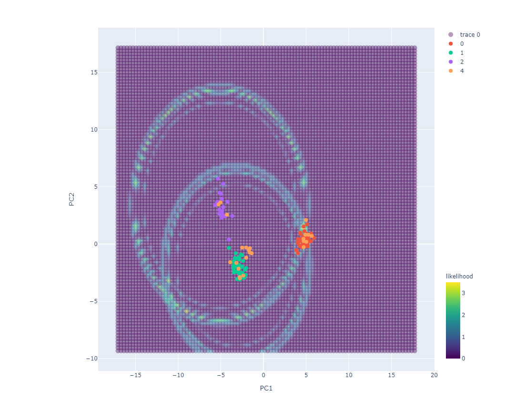

## Imputation repository.

This sub-directory holds work on imputation. As usual, this research is done with population genetic data in mind. 

The data consists a single genotype data set. Variables are variant count features ranging between 0 and 2; Samples are designed to derive from a semi-consistent population network. _Semi-consistent_ is used here to indicate that certain observations have variable pdfs, and the characteristics of the structure vary (cluster distance may change).

### Data generation

VCF files are generated using the [Genome Simulator](https://nbviewer.jupyter.org/github/SantosJGND/Tools_and_toys/blob/master/Simulate_genomes/Genomic%20structure%20Simulator.ipynb) tool of the first Tools repository [link](https://github.com/SantosJGND/Tools_and_toys).

- replicated here for the specific data sets used [notebook](https://nbviewer.jupyter.org/github/SantosJGND/Tools_II/blob/master/Imputation/prepare_vcfs.ipynb).

### I. Distances / Dimensionality reduction. 

Window based analysis constructs data sets of distance data with which to predict position of missing observation in incomplete data set.

> [notebook](https://nbviewer.jupyter.org/github/SantosJGND/Tools_II/blob/master/Imputation/Impute_I_distances.ipynb)

### II. PCA inverse transformation.

An aside on the accuracy of PCA inverse transformation.

> [notebook](https://nbviewer.jupyter.org/github/SantosJGND/Imputation/blob/master/INV_transform.ipynb)

### III. Cluster search. 

Dimensionality reduction and maximum likelihood cluster classification. Use for stats, imputation. 

> [notebook](https://nbviewer.jupyter.org/github/SantosJGND/Imputation/blob/master/Reconstruct_trees.ipynb)

### Application to rice data.

**i. Haplotype imputation** 

Based on the method described in section **I.**. Additions include: composite likelihood; control for distance; exclusion of observations carrying missing or heterozygous calls in local distance calculations.

**data requirement**: haplotype, phased, or nearly homozygous data.

**validation**: benchmark included. 

> [notebook](https://nbviewer.jupyter.org/github/SantosJGND/Imputation/blob/d55c5e8cd6906c3dd46bc7539408fea53463146c/rice_impute.ipynb)

**ii. cluster distance and imputation**

Application of the cluster search and inference pipeline on 3000 Rice Genomes data. Focus on Japonica and cBasmati variation. Distance inference now performed within 1MB of focal target. 

> [notebook](https://nbviewer.jupyter.org/github/SantosJGND/Imputation/blob/master/rice_ClusterSearch.ipynb)

**iii. targeted Ne estimation at local windows**

> [notebook](https://nbviewer.jupyter.org/github/SantosJGND/Imputation/blob/master/Theta_ClusterSearch.ipynb)

